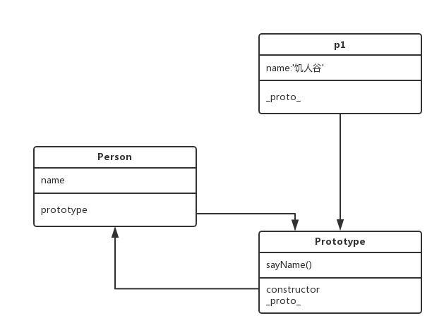

## this 相关问题


#### 1： apply、call 、bind有什么作用，什么区别
- apply
    - 执行一个函数，传入函数执行时的this和上下文及参数,传入的参数为(obj,arguments)
    ```
    var test = {
        hello : 'hello',
        world : 'world',
        sayHello : function(person){
            console.log(this.hello+' '+this.world+' from '+person)
        }
    }
    var obj = {
        hello: 'byebye',
        world: 'baby'
    }

    test.sayHello('baby')
    var arr = ['mather']
    test.sayHello.call(obj,arr)
    ```

- call
    - 执行一个函数，传入函数执行时的this和上下文及参数,传入的参数为(obj,param0...)
    ```
    var test = {
        hello : 'hello',
        world : 'world',
        sayHello : function(person){
            console.log(this.hello+' '+this.world+' from '+person)
        }
    }
    var obj = {
        hello: 'byebye',
        world: 'baby'
    }

    test.sayHello('baby')  //hello world from baby
    test.sayHello.call(obj,'mather')  //byebye baby from mather
    ```

- bind
    - 返回一个新函数，并且使函数内部的this为传入的第一个参数
    ```
    var obj1 = {
        name: 'Byron',
        fn : function(){
            console.log(this);
        }
    }
    var fn2 = obj1.fn
    fn2()   //window
    var fn2 = obj1.fn.bind(obj1)
    console.log(fn3)
    fn2()   //obj1
    ```
    - fn2是一个变量，实际上是一个函数，`f2`与`var f2=function(){console.log(this)}`是相同的，一般情况下，f2打印出来的应该是使用他的对象,由于我们实在全局中直接使用，所以返回window，但是通过`var fn2 = obj1.fn.bind(obj1)`将他的this为obj1

- 区别
    - apply与call的主要区别为传入参数的格式不同，apply传入要绑定的this和一个数组，call传入要绑定this的对象和参数，不同参数用逗号隔开
    - bind与apply、call的区别在于bind是声明函数时使用，而aplly、call在调用的时候使用

---


#### 2： 以下代码输出什么?
```
var john = { 
  firstName: "John" 
}
function func() { 
  alert(this.firstName + ": hi!")
}
john.sayHi = func
john.sayHi()
```
- 输出 `John:hi!'=`

---

#### 3： 下面代码输出什么，为什么
```
func() 
function func() { 
  alert(this)
}
```
- 输出 `window` 谁调用函数就是this就指向谁，fun()可以看成是window.func()

---


#### 4：下面代码输出什么
```
document.addEventListener('click', function(e){
    console.log(this);
    setTimeout(function(){
        console.log(this);
    }, 200);
}, false);
```
- 输出 `document` , `window`

---

#### 5：下面代码输出什么，why
```
var john = { 
  firstName: "John" 
}

function func() { 
  alert( this.firstName )
}
func.call(john)
```
- 输出：`John`

- 原因：使用`call()`调用`func`并且将`func`内部的this的值改为`john`

---

#### 6： 以下代码有什么问题 ，如何修改
```
var module= {
  bind: function(){
    $btn.on('click', function(){
      console.log(this) //this指$btn所代表的DOM元素
      this.showMsg();
    })
  },
  
  showMsg: function(){
    console.log('饥人谷');
  }
}
```
- 出现的问题 事件监听里面的this指向的是$btn所代表的DOM元素，而这个DOM元素是没有showMsg方法的

- 修改
    ```
    var module= {
        bind: function(){
            $btn.on('click', function(){
            console.log(this) //this指$btn所代表的DOM元素
            this.showMsg();
            }.bind(this))
        },
        
        showMsg: function(){
            console.log('饥人谷');
        }
    }
    ```

--- 

## 原型链相关问题
#### 7：有如下代码，解释Person、 prototype、`__proto__`、p、constructor之间的关联。
```
function Person(name){
    this.name = name;
}
Person.prototype.sayName = function(){
    console.log('My name is :' + this.name);
}
var p = new Person("若愚")
p.sayName();
```

- `Person.prototype = p.__proto__`
- `Person.prototype.constructor = Person`
- `p.__proto__ = Person`

---

#### 8： 上例中，对对象 p可以这样调用 p.toString()。toString是哪里来的? 画出原型图?并解释什么是原型链。



- `.toString()`方法在`Person.prototype.__proto__`中，也就是`p.__proto__.__proto__`中

- JavaScript中通过一种链条的形式完成继承，例如我们声明一个空数组arrItem，虽然是一个空数组，但是却可以使用一切对象的方法，在这个数组的`__proto__`中拥有数组的所有方法，但是却没有对象的方法，继续向在`__proto__`中查找就会找到所有对象的方法。这个逐级向上查找所经过的类似链条一样的东西，我们就叫他原型链。


---

#### 9：对String做扩展，实现如下方式获取字符串中频率最高的字符
```
var str = 'ahbbccdeddddfg';
var ch = str.getMostOften();
console.log(ch); //d , 因为d 出现了5次
```

#### 10： instanceOf有什么作用？内部逻辑是如何实现的？
- 作用

- 内部实现


## 继承相关问题

#### 11：继承有什么作用?
- 作用

---

#### 12： 下面两种写法有什么区别?
```
//方法1
function People(name, sex){
    this.name = name;
    this.sex = sex;
    this.printName = function(){
        console.log(this.name);
    }
}
var p1 = new People('饥人谷', 2)

//方法2
function Person(name, sex){
    this.name = name;
    this.sex = sex;
}

Person.prototype.printName = function(){
    console.log(this.name);
}
var p1 = new Person('若愚', 27);
```

- 区别

---

#### 13： Object.create 有什么作用？兼容性如何？
- 作用

- 兼容性

---

#### 14： hasOwnProperty有什么作用？ 如何使用？
- 作用

- 使用

---

#### 15：如下代码中call的作用是什么?
```
function Person(name, sex){
    this.name = name;
    this.sex = sex;
}
function Male(name, sex, age){
    Person.call(this, name, sex);    //这里的 call 有什么作用
    this.age = age;
}
```
- 作用

---

#### 16： 补全代码，实现继承 
```
function Person(name, sex){
    // todo ...
}

Person.prototype.getName = function(){
    // todo ...
};    

function Male(name, sex, age){
   //todo ...
}

//todo ...
Male.prototype.getAge = function(){
    //todo ...
};

var ruoyu = new Male('若愚', '男', 27);
ruoyu.printName();
```