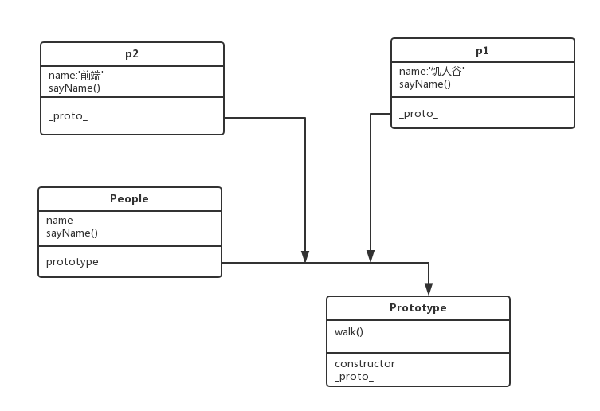

#### 1： OOP 指什么？有哪些特性
- OOP:面向对象程序设计，就是把所有的共有属性和操作堆放在一起，堆在一起的这个操作叫做封装，封装完毕产生的东西叫做对象，由不同的使用者传入属性实例化的叫做对象。
- OOP的特性
    - 封装: 把共用的属性放在一起。然后留出每个实例有可能不同的地方。使用者只需要调用和传参就可以使用，不需要知道内部的实现原理。
    - 继承: 子类可以继承父类，子类可以在继承后，重写父类的方法和变量。这样可以提高代码的重用性。
    - 多态: 子类继承父类方法和变量后，可以重写。

---

#### 2： 如何通过构造函数的方式创建一个拥有属性和方法的对象? 
```
function Person(name){
    this.name=name
    this.sayName=function(){
        console.log(this.name)
    }
    return{
        sayName:this.sayName
    }
}

var dingHaoRan = new Person('丁浩然')
```

---

#### 3： prototype 是什么？有什么特性 
- 每个函数都是一个Function对象，Function对象都有一个prototype对象。prototype表示的是函数的原型。
- prototype相当于是一个公共容器，供所有实例访问，节省空间。当实例对象本身没有某个属性或方法的时候，它会到构造函数的 prototype 属性 指向的对象，去寻找该属性或方法。如果实例对象自身就有某个属性或方法，它就不会再去原型对象寻找这个属性或方法。

---

#### 4：画出如下代码的原型图
```
function People (name){
  this.name = name;
  this.sayName = function(){
    console.log('my name is:' + this.name);
  }
}

People.prototype.walk = function(){
  console.log(this.name + ' is walking');  
}

var p1 = new People('饥人谷');
var p2 = new People('前端');
```


---

#### 5： 创建一个 Car 对象，拥有属性name、color、status；拥有方法run，stop，getStatus 
```
function Car(name,color,status){
    this.name=name
    this.color=color
    this.status=status
    this.run=function(){
        //...
    }
    this.stop=function(){
        //...
    }
    this.getStatus=function(){
        //...                
    }
}
```

---

#### 6： 创建一个 GoTop 对象，当 new 一个 GotTop 对象则会在页面上创建一个回到顶部的元素，点击页面滚动到顶部。拥有以下属性和方法

1. `ct`属性，GoTop 对应的 DOM 元素的容器
2. `target`属性， GoTop 对应的 DOM 元素
3. `bindEvent` 方法， 用于绑定事件
4. `createNode` 方法， 用于在容器内创建节点

```
var ct = document.getElementById('ct')
function GoTop (ct){
    this.ct = $(ct)
    this.target = $('<a href="#">GoTop</a>')
    this.bindEvent = function(){
        this.target.click(function(){
            $(window).scrollTop(0)
        })
    }
    this.createNode = function(){
        this.ct.append(this.target)
    }
}
var test = new GoTop(ct)
test.createNode()
test.bindEvent()
```

---

#### 7： 使用木桶布局实现一个图片墙

